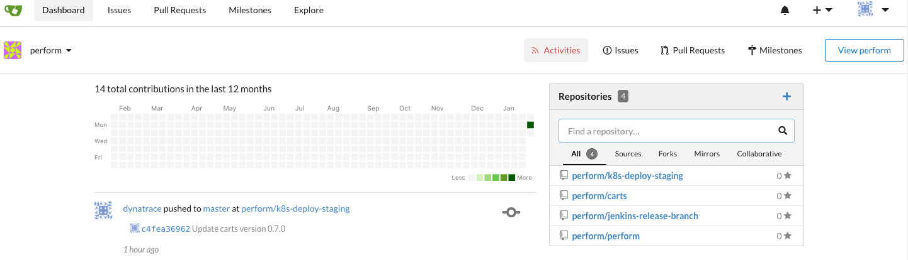

# Environment overview and configuration
Before getting started configuring our quality gate we will review the build and release process and trigger a full build from development up to production using Jenkins and our applications carts.

## Step 1 - Get into the virtual machine using ssh
In order to get into our working environment we will be using an ssh to conect to our AWS machine. 
```(bash)
 $ ssh username@aws-ip 
 use the ip and password from Dynatrace University
```

## Step 2 - Explore the different namespaces using kubectl
Out of the box we have applications running in our Kubernetes cluster using k3s. In order to visualize the namespaces where the applications live run the following command 
```(bash)
$ kubectl get namespaces
```
You should see something like this: 

```(bash)
NAME              STATUS   AGE
default           Active   55m
kube-system       Active   55m
kube-public       Active   55m
kube-node-lease   Active   55m
dynatrace         Active   55m
ingress-nginx     Active   55m
gitea             Active   54m
dev               Active   52m
staging           Active   52m
production        Active   52m
registry          Active   52m
jenkins           Active   52m
app-one           Active   51m
app-two           Active   51m
app-three         Active   51m
dashboard         Active   51m
```
We will be working with some of these namespaces to deploy our application across the different stages from dev > staging > production

In order to visualize what's already running in a namespace use:

```(bash)
kubectl -n dev get all 
```
You should see the database for the carts microservice already in there.
```(bash)
NAME               TYPE           CLUSTER-IP     EXTERNAL-IP   PORT(S)        AGE
service/carts-db   ClusterIP      10.43.20.194   <none>        27017/TCP      9h
```
## Step 3 - Review the ingress configuration
To understand more about the way our applications are exposed we can look for our ingress configuration. 

```(bash)
kubectl get ingresses --all-namespaces
```
```(bash)
NAMESPACE   NAME                CLASS    HOSTS                                      ADDRESS     PORTS   AGE
gitea       gitea-gitea         <none>   gitea.xx.xx.xxx.nip.io                  10.0.0.90   80      9h
jenkins     jenkins             <none>   jenkins.xx.xx.xxx.nip.io                10.0.0.90   80      9h
```
## Step 4 - Explore Gitea
Navigate into Gitea by using the host domain from step 3. Username and password will be provided during the lab.



## Step 5 - Explore Jenkins
Navigate into Jenkins by using the host domain from step 3. Username and password will be provided during the lab.


## Step 6 - Build the first version of the application
Go into `Jenkins > sockshop > carts` and trigger the first build of the application. After the build is done, you should visualize the micro service running using ```kubectl -n dev get deploy carts```. Since this is a backend service, you can hit the API using the url `carts.dev.xxx.xxx.xx.nip.io`


## Step 7 - Release the first version to staging
Go into `Jenkins > sockshop > create-release-branch` and use carts as parameter to create a new branch for our release to staging. Then go into `Jenkins > sockshop > Scan Multibranch Pipeline Now` to visualize the new branch created and trigger automatically a new build.

After the build has finished run `kubectl -n staging get deploy carts` to see the new artifact in the staging environment.

## Next steps
We have now a working version of our microservice running in dev and staging, but we haven't implemented any quality check yet. In the next labs, we will configure Keptn + Dynatrace + Jenkins to implement a Quality Gate and we see how this can prevent bad builds from being promoted into staging.


:arrow_forward: [Next Step: Install Keptn](../02_Configure_Keptn_Dynatrace_Integration)

:arrow_up_small: [Back to overview](../)


