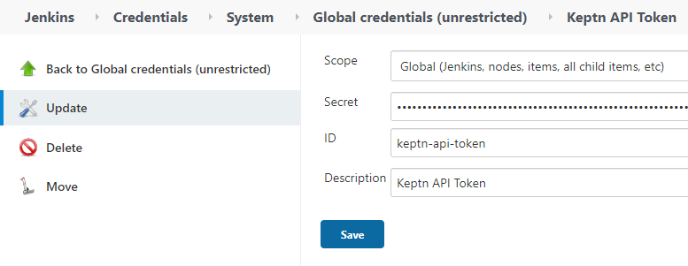
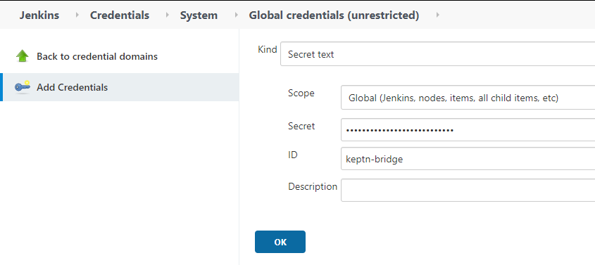

# Configure Keptn library for Jenkins
In this lab you'll learn how to configure the Keptn library for Jenkins.


## Step 1: Review Keptn library installation

Following the `everything as code` best practice, we will update the Jenkins deployment using Helm.

1. On the bastion find the `jenkins-values.yml` file using the following

    ```bash
    (bastion)$ cd
    (bastion)$ vi ~/jenkins/helm/jenkins-values.yml
    ```

    **Note:** To activate the line numbering on vim, set the number flag, :one: Press the `Esc` key to switch to command mode. :two: Press `:` (colon) and the cursor will move at the bottom left corner of the screen. Type `set number` or `set nu` and hit Enter.

1. Find the code block that defines the dynatrace libs (near or at line 483):

    ```yaml
          globalLibraries:
            libraries:
            - name: "dynatrace"
              retriever:
                modernSCM:
                  scm:
                    git:
                      id: "6813bac3-894e-434d-9abb-bd41eeb72f88"
                      remote: "https://github.com/dynatrace-ace/dynatrace-jenkins-library.git"
                      traits:
                      - "gitBranchDiscovery"
            ### add keptn library under this line
    ```

1. Add the following code block under the line commented out and save the file **(make sure indentation is correct)**:

    ```yaml
            - defaultVersion: "master"
              name: "keptn-library"
              retriever:
                modernSCM:
                  scm:
                    git:
                      remote: "https://github.com/keptn-sandbox/keptn-jenkins-library.git"
                      traits:
                      - "gitBranchDiscovery"
    ```

1. After adding the keptn libs, the Jenkins global libraries code block should look similar to this:

    ```yaml
          globalLibraries:
            libraries:
            - name: "dynatrace"
              retriever:
                modernSCM:
                  scm:
                    git:
                      id: "6813bac3-894e-434d-9abb-bd41eeb72f88"
                      remote: "https://github.com/dynatrace-ace/dynatrace-jenkins-library.git"
                      traits:
                      - "gitBranchDiscovery"
            ### add keptn library under this line
            - defaultVersion: "master"
              name: "keptn-library"
              retriever:
                modernSCM:
                  scm:
                    git:
                      remote: "https://github.com/keptn-sandbox/keptn-jenkins-library.git"
                      traits:
                      - "gitBranchDiscovery"
    ```

1. Apply the configurations to Jenkins using helm:

    ```bash
    (bastion)$ cd
    (bastion)$ ./deployJenkins.sh
    ```


1. Go into Jenkins and review the [keptn library](https://github.com/keptn-sandbox/keptn-jenkins-library.git) installation `Jenkins > Manage Jenkins > Configure System > Global Pipeline Libraries`.


## Step 2: Get Keptn credentials

Retrieve the Keptn credentials using the following

```bash
(bastion)$ export KEPTN_API_TOKEN=$(kubectl get secret keptn-api-token -n keptn -ojsonpath={.data.keptn-api-token} | base64 --decode)
(bastion)$ echo $KEPTN_API_TOKEN
(bastion)$ export KEPTN_BRIDGE=http://$(kubectl -n keptn get ingress keptn -ojsonpath='{.spec.rules[0].host}')/bridge
(bastion)$ echo $KEPTN_BRIDGE
(bastion)$ export KEPTN_ENDPOINT=http://$(kubectl -n keptn get ingress keptn -ojsonpath='{.spec.rules[0].host}')/api
(bastion)$ echo $KEPTN_ENDPOINT
```

## Step 3: Store Keptn credentials in Jenkins

 Inside Jenkins go into `Manage Jenkins > Manage credentials ` and select the first element with the house icon.


Then click `Global credentials > Add credentials`, use the dropdown Kind and select `secret text` and input the values from step 2. Repeat the process for each variable. For the ID field use the name from the images.





[Previous Step: Configure Keptn & Dynatrace integration](../02_Configure_Keptn_Dynatrace_Integration) :arrow_backward: :arrow_forward: [Next Step: Define Request Attributes](../04_Define_Request_Attributes)

:arrow_up_small: [Back to overview](../)
